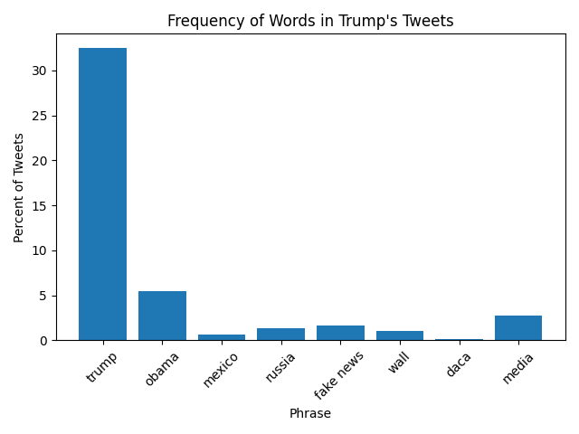
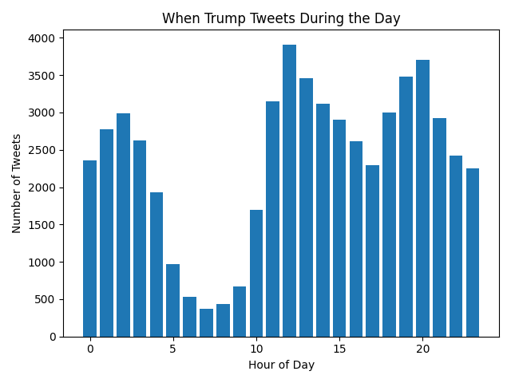

# Trump Tweet Analysis

This lab analyzes Donald Trump's tweets using the Trump Archive dataset using the json file from "https://www.thetrumparchive.com/faq" (the extra credit file).

## Phrase Frequency

The table below shows the percentage of tweets containing selected political phrases from the json file.

| phrase            | percent of tweets |
| ----------------- | ----------------- |
|              daca | 00.15 |
|         fake news | 01.66 |
|             media | 02.74 |
|            mexico | 00.62 |
|             obama | 05.51 |
|            russia | 01.32 |
|             trump | 32.45 |
|              wall | 01.08 |

## Visualization

The bar graph below shows how frequently selected phrases appear in Trump's tweets.

## Tweets by Hour (Extra Credit)

This graph shows what time of day Trump tweets most often.

